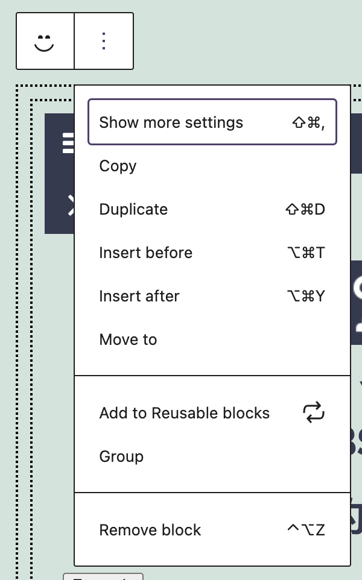
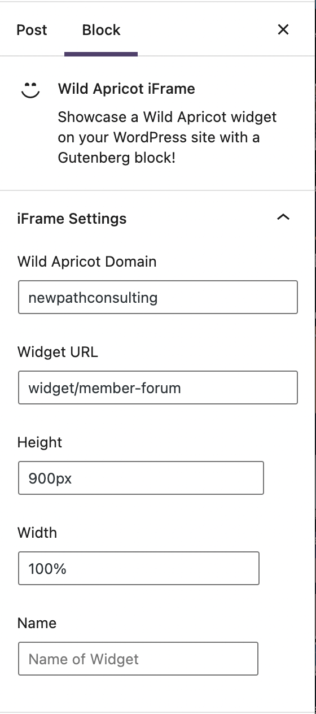

# WAP Wild Apricot iFrame Add On

This plugin installs a Gutenberg block which allows the user to include an iFrame with a Wild Apricot widget.

## How to install
0. Clone or download this repository.
1. Compress the plugin folder.
2. Upload the plugin zip archive to your WordPress site using the plugin installer.

OR

0. Clone or download this repository directly in your WordPress site's `wp-content/plugins` folder.
1. Browse to the "Plugins" page on your site, look for "WAP Wild Apricot iFrame Add-on", and activate the plugin.

You must also obtain a [free license to enable use](https://github.com/NewPath-Consulting/Wild-Apricot-Press#license). See the [NewPath website](https://newpathconsulting.com/wawp) to register for a free license.

## How to use
1. Make a new post or page. Browse to the block inserter (`+` on the top left of the post editor).
2. Find the WAP Wild Apricot iFrame block in the Embeds section.
3. Click on the block to insert it.
4. To configure the block, click on the block options and select "Show more settings"

You now should be able to see the block settings panel on the right side of the post editor.

5. Enter your Wild Apricot domain name `<yourorgname>.wildapricot.org` and the path of the widget you wish to embed.

Instructions on the available Wild Apricot widgets are available [here](https://gethelp.wildapricot.com/en/articles/222-using-widgets).

## How to contribute

#### Setup
0. Clone this repository in your WordPress site's `wp-content/plugins` folder.
1. Follow the instructions on [WordPress's block development environment setup tutorial](https://developer.wordpress.org/block-editor/handbook/tutorials/devenv/).
2. Enter the command `npm install` in the root of this directory.

#### Run and test
3. Run `npm start` to run the React compiler.
4. To test this plugin, activate it from the plugin UI and find "WAP Wild Apricot iFrame" in the block inserter. Since the plugin folder is already in the plugins directory, there is no need to reinstall it when you're testing. **Always make sure the build (in `build`) files are up-to-date when testing this plugin**.

#### Other useful `npm` commands
`npm start`
Starts the build for development.

`npm run build`
Builds the code for production.

`npm run format`
Formats files.

`npm run lint:css`
Lints CSS files.

`npm run lint:js`
Lints JavaScript files.

`npm run packages-update`
Updates WordPress packages to the latest version.
